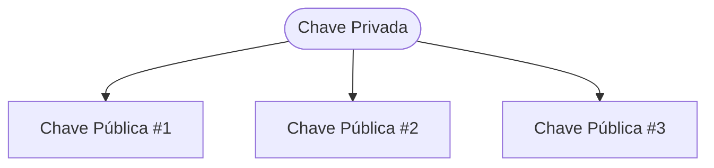
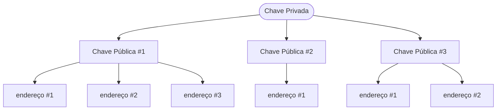
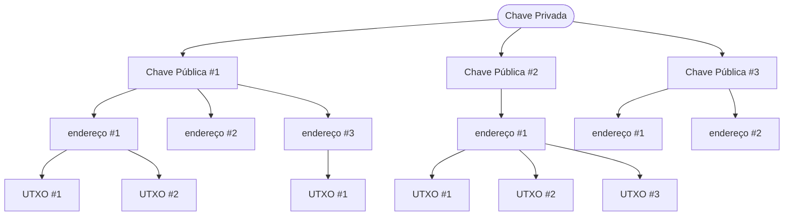
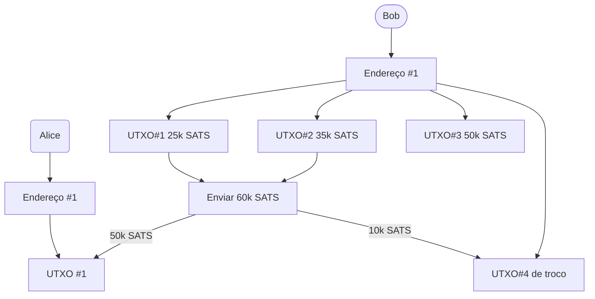

## Chave Pública Chave Privada

```mermaid
flowchart TD
    A(["Chave Privada"]) --> B["Chave Pública #1"] & n1@{ label: "<span style=\"padding-left:\">Chave Pública #2</span>" } & n2@{ label: "<span style=\"padding-left:\"><span style=\"padding-left:\">Chave Pública #3</span></span>" }
    B@{ shape: rect}
    n1@{ shape: rect}
    n2@{ shape: rect}
```

```mermaid
flowchart TD
    A(["Chave Privada"]) --> B["Chave Pública #1"] & n1@{ label: "<span style=\"padding-left:\">Chave Pública #2</span>" } & n2@{ label: "<span style=\"padding-left:\"><span style=\"padding-left:\">Chave Pública #3</span></span>" }
    B --> n3["endereço #1"] & n4@{ label: "<span style=\"padding-left:\">endereço #2</span>" } & n5@{ label: "<span style=\"padding-left:\">endereço #3</span>" }
    n1 --> n6@{ label: "<span style=\"padding-left:\">endereço #1</span>" }
    n2 --> n7@{ label: "<span style=\"padding-left:\">endereço #1</span>" } & n8@{ label: "<span style=\"padding-left:\"><span style=\"padding-left:\">endereço #2</span></span>" }
    B@{ shape: rect}
    n1@{ shape: rect}
    n2@{ shape: rect}
    n4@{ shape: rect}
    n5@{ shape: rect}
    n6@{ shape: rect}
    n7@{ shape: rect}
    n8@{ shape: rect}
```

```mermaid
flowchart TD
    A(["Chave Privada"]) --> B["Chave Pública #1"] & n1@{ label: "<span style=\"padding-left:\">Chave Pública #2</span>" } & n2@{ label: "<span style=\"padding-left:\"><span style=\"padding-left:\">Chave Pública #3</span></span>" }
    B --> n3["endereço #1"] & n4@{ label: "<span style=\"padding-left:\">endereço #2</span>" } & n5@{ label: "<span style=\"padding-left:\">endereço #3</span>" }
    n1 --> n6@{ label: "<span style=\"padding-left:\">endereço #1</span>" }
    n2 --> n7@{ label: "<span style=\"padding-left:\">endereço #1</span>" } & n8@{ label: "<span style=\"padding-left:\"><span style=\"padding-left:\">endereço #2</span></span>" }
    n3 --> n9["UTXO #1"] & n10["UTXO #2"]
    n5 --> n11["UTXO #1"]
    n6 --> n12@{ label: "<span style=\"padding-left:\">UTXO #1</span>" } & n13@{ label: "<span style=\"padding-left:\">UTXO #2</span>" } & n14@{ label: "<span style=\"padding-left:\">UTXO #3</span>" }

    B@{ shape: rect}
    n1@{ shape: rect}
    n2@{ shape: rect}
    n4@{ shape: rect}
    n5@{ shape: rect}
    n6@{ shape: rect}
    n7@{ shape: rect}
    n8@{ shape: rect}
    n12@{ shape: rect}
    n13@{ shape: rect}
    n14@{ shape: rect}
```

```mermaid
flowchart TD
    A(["Bob"]) --> n1["Endereço #1"]
    n6["Alice"] --> n9["Endereço #1"]
    n1 --> n2["UTXO#1 25k SATS"] & n3@{ label: "<span style=\"padding-left:\">UTXO#2 35k SATS</span>" } & n4@{ label: "<span style=\"padding-left:\"><span style=\"padding-left:\">UTXO#3 50k SATS</span></span>" } & n8["UTXO#4 de troco"]
    n2 --> n5["Enviar 60k SATS"]
    n3 --> n5
    n5 -- 50k SATS --> n10
    n5 -- 10k SATS --> n8
    n9 --> n10["UTXO #1"]
    n3@{ shape: rect}
    n4@{ shape: rect}
    n6@{ shape: rounded}
```
## Transação

```mermaid
flowchart TD
    A(["BOB"]) -- Assina com a chave privada --> n1["Transação"]
    n1 -- Transmitida --> n2["Blockchain"]
    n2 -- Minera --> n3(["Alice"])
    n1@{ shape: rect}
```
