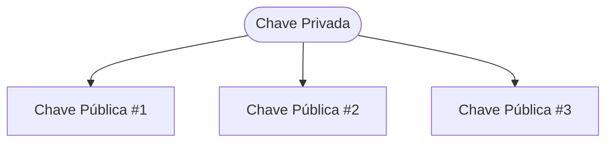
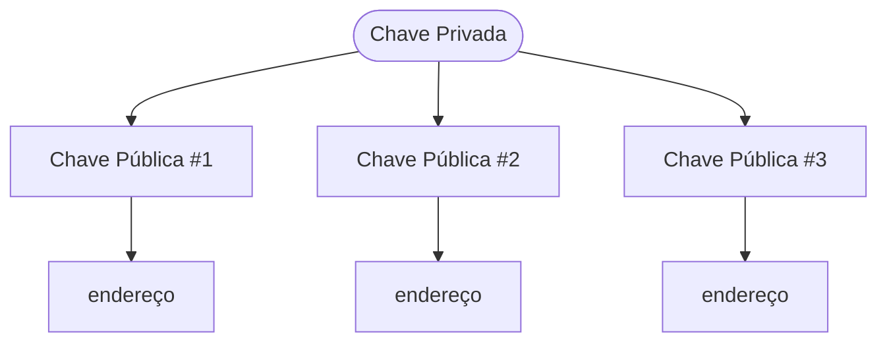
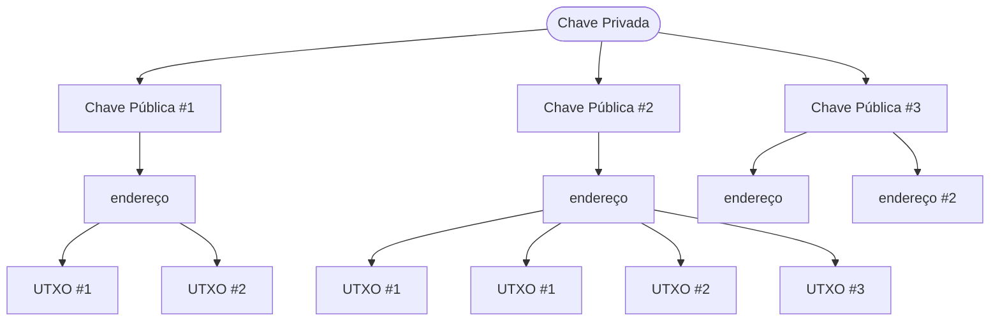
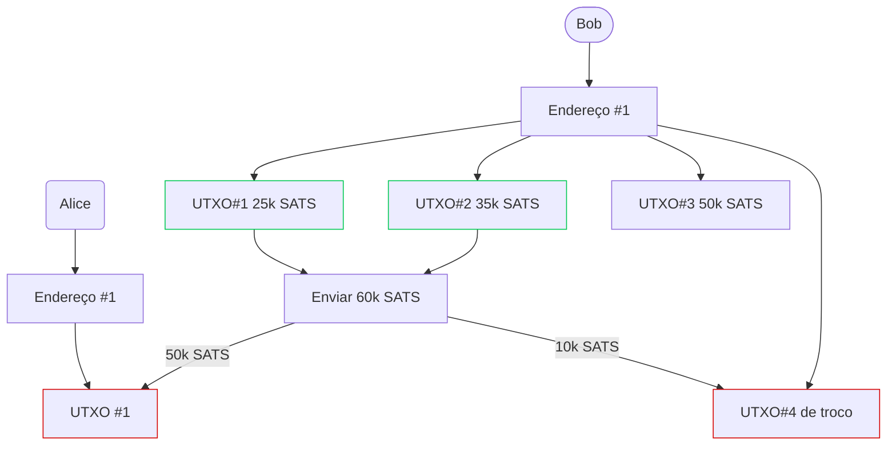
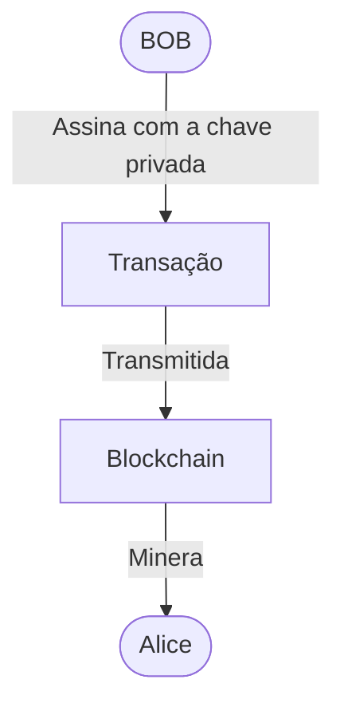
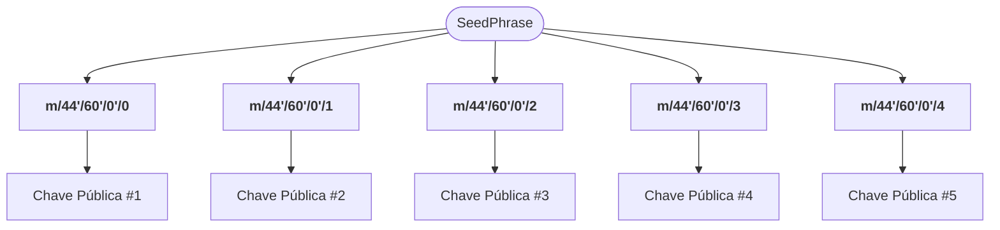

## Chave Pública Chave Privada

```mermaid
flowchart TD
    A(["Chave Privada"]) --> B["Chave Pública #1"] & n1@{ label: "<span style=\"padding-left:\">Chave Pública #2</span>" } & n2@{ label: "<span style=\"padding-left:\"><span style=\"padding-left:\">Chave Pública #3</span></span>" }
    B@{ shape: rect}
    n1@{ shape: rect}
    n2@{ shape: rect}
```
## Endereço

```mermaid
flowchart TD
    A(["Chave Privada"]) --> B["Chave Pública #1"] & n1@{ label: "<span style=\"padding-left:\">Chave Pública #2</span>" } & n2@{ label: "<span style=\"padding-left:\"><span style=\"padding-left:\">Chave Pública #3</span></span>" }
    B --> n3["endereço"]
    n1 --> n4["endereço"]
    n2 --> n5["endereço"]
    B@{ shape: rect}
    n1@{ shape: rect}
    n2@{ shape: rect}
    n4@{ shape: rect}
    n5@{ shape: rect}
```
## UTXO

```mermaid
flowchart TD
    A(["Chave Privada"]) --> B["Chave Pública #1"] & n1@{ label: "<span style=\"padding-left:\">Chave Pública #2</span>" } & n2@{ label: "<span style=\"padding-left:\"><span style=\"padding-left:\">Chave Pública #3</span></span>" }
    B --> n3["endereço"] 
    n1 --> n6@{ label: "<span style=\"padding-left:\">endereço</span>" } --> n11["UTXO #1"]
    n2 --> n7@{ label: "<span style=\"padding-left:\">endereço</span>" } & n8@{ label: "<span style=\"padding-left:\"><span style=\"padding-left:\">endereço #2</span></span>" }
    n3 --> n9["UTXO #1"] & n10["UTXO #2"] 
    n6 --> n12@{ label: "<span style=\"padding-left:\">UTXO #1</span>" } & n13@{ label: "<span style=\"padding-left:\">UTXO #2</span>" } & n14@{ label: "<span style=\"padding-left:\">UTXO #3</span>" }

    B@{ shape: rect}
    n1@{ shape: rect}
    n2@{ shape: rect}
    n6@{ shape: rect}
    n7@{ shape: rect}
    n8@{ shape: rect}
    n12@{ shape: rect}
    n13@{ shape: rect}
    n14@{ shape: rect}
```
## Input / Output

```mermaid
flowchart TD
    A(["Bob"]) --> n1["Endereço #1"]
    n6["Alice"] --> n9["Endereço #1"]
    n1 --> n2["UTXO#1 25k SATS"] & n3@{ label: "<span style=\"padding-left:\">UTXO#2 35k SATS</span>" } & n4@{ label: "<span style=\"padding-left:\"><span style=\"padding-left:\">UTXO#3 50k SATS</span></span>" } & n8["UTXO#4 de troco"]
    n2 --> n5["Enviar 60k SATS"]
    n3 --> n5
    n5 -- 50k SATS --> n10["UTXO #1"]
    n5 -- 10k SATS --> n8
    n9 --> n10
    n6@{ shape: rounded}
    n3@{ shape: rect}
    n4@{ shape: rect}
    style n2 stroke:#00C853
    style n3 stroke:#00C853
    style n8 stroke:#D50000
    style n10 stroke:#D50000
```
## Transação

```mermaid
flowchart TD
    A(["BOB"]) -- Assina com a chave privada --> n1["Transação"]
    n1 -- Transmitida --> n2["Blockchain"]
    n2 -- Minera --> n3(["Alice"])
    n1@{ shape: rect}
```
## SeedPhrase

```mermaid
flowchart TD
    n17@{ label: "<strong>m/44'/60'/0'/4</strong>" } --> B@{ label: "<span style=\"padding-left:\"><span style=\"padding-left:\"><span style=\"padding-left:\"><span style=\"padding-left:\">Chave Pública #5</span></span></span></span>" }
    A(["SeedPhrase"]) -- <br> --> n1@{ label: "<span style=\"padding-left:\"><strong>m/44'/60'/0'/0</strong></span>" } & n2@{ label: "<span style=\"padding-left:\"><span style=\"padding-left:\"><strong>m/44'/60'/0'/1</strong></span></span>" } & n15@{ label: "<span style=\"padding-left:\"><span style=\"padding-left:\"><span style=\"padding-left:\"><strong>m/44'/60'/0'/2</strong></span></span></span>" } & n16@{ label: "<span style=\"padding-left:\"><span style=\"padding-left:\"><span style=\"padding-left:\"><span style=\"padding-left:\"><strong>m/44'/60'/0'/3</strong></span></span></span></span>" }
    A --> n17
    n1 --> n18@{ label: "<span style=\"padding-left:\">Chave Pública #1</span>" }
    n2 --> n19@{ label: "<span style=\"padding-left:\"><span style=\"padding-left:\">Chave Pública #2</span></span>" }
    n15 --> n20@{ label: "<span style=\"padding-left:\"><span style=\"padding-left:\"><span style=\"padding-left:\">Chave Pública #3</span></span></span>" }
    n16 --> n21@{ label: "<span style=\"padding-left:\"><span style=\"padding-left:\"><span style=\"padding-left:\"><span style=\"padding-left:\">Chave Pública #4</span></span></span></span>" }

    n17@{ shape: rect}
    B@{ shape: rect}
    n1@{ shape: rect}
    n2@{ shape: rect}
    n15@{ shape: rect}
    n16@{ shape: rect}
    n18@{ shape: rect}
    n19@{ shape: rect}
    n20@{ shape: rect}
    n21@{ shape: rect}
```
## PassPhrase

```mermaid
flowchart TD
    n17@{ label: "<strong>m/44'/60'/0'/4</strong>" } -- "<span style=padding-left:><span style=padding-left:>Passphrase: thekey</span></span>" --> B@{ label: "<span style=\"padding-left:\"><span style=\"padding-left:\"><span style=\"padding-left:\"><span style=\"padding-left:\">Chave Pública #5</span></span></span></span>" }
    A(["SeedPhrase"]) -- <br> --> n1@{ label: "<span style=\"padding-left:\"><strong>m/44'/60'/0'/0</strong></span>" } & n2@{ label: "<span style=\"padding-left:\"><span style=\"padding-left:\"><strong>m/44'/60'/0'/1</strong></span></span>" } & n15@{ label: "<span style=\"padding-left:\"><span style=\"padding-left:\"><span style=\"padding-left:\"><strong>m/44'/60'/0'/2</strong></span></span></span>" } & n16@{ label: "<span style=\"padding-left:\"><span style=\"padding-left:\"><span style=\"padding-left:\"><span style=\"padding-left:\"><strong>m/44'/60'/0'/3</strong></span></span></span></span>" }
    A --> n17
    n1 -- Passphrase: hi --> n18@{ label: "<span style=\"padding-left:\">Chave Pública #1</span>" }
    n1 -- "<span style=padding-left:>Passphrase: qzomes</span>" --> n22@{ label: "<span style=\"padding-left:\"><span style=\"padding-left:\">Chave Pública #1.1</span></span>" }
    n2 -- "<span style=padding-left:><span style=padding-left:>Passphrase: hi</span></span>" --> n19@{ label: "<span style=\"padding-left:\"><span style=\"padding-left:\">Chave Pública #2</span></span>" }
    n15 -- "<span style=padding-left:><span style=padding-left:>Passphrase: hello</span></span>" --> n20@{ label: "<span style=\"padding-left:\"><span style=\"padding-left:\"><span style=\"padding-left:\">Chave Pública #3</span></span></span>" }
    n16 -- "<span style=padding-left:><span style=padding-left:>Passphrase: simple</span></span>" --> n21@{ label: "<span style=\"padding-left:\"><span style=\"padding-left:\"><span style=\"padding-left:\"><span style=\"padding-left:\">Chave Pública #4</span></span></span></span>" }
    n15 -- "<span style=padding-left:><span style=padding-left:><span style=padding-left:>Passphrase: cherry</span></span></span>" --> n23@{ label: "<span style=\"padding-left:\"><span style=\"padding-left:\"><span style=\"padding-left:\"><span style=\"padding-left:\">Chave Pública #3.1</span></span></span></span>" }
    n15 -- "<span style=padding-left:><span style=padding-left:><span style=padding-left:><span style=padding-left:>Passphrase: ladychocolady</span></span></span></span>" --> n24@{ label: "<span style=\"padding-left:\"><span style=\"padding-left:\"><span style=\"padding-left:\"><span style=\"padding-left:\"><span style=\"padding-left:\">Chave Pública #3.2</span></span></span></span></span>" }

    n17@{ shape: rect}
    B@{ shape: rect}
    n1@{ shape: rect}
    n2@{ shape: rect}
    n15@{ shape: rect}
    n16@{ shape: rect}
    n18@{ shape: rect}
    n22@{ shape: rect}
    n19@{ shape: rect}
    n20@{ shape: rect}
    n21@{ shape: rect}
    n23@{ shape: rect}
    n24@{ shape: rect}
```
