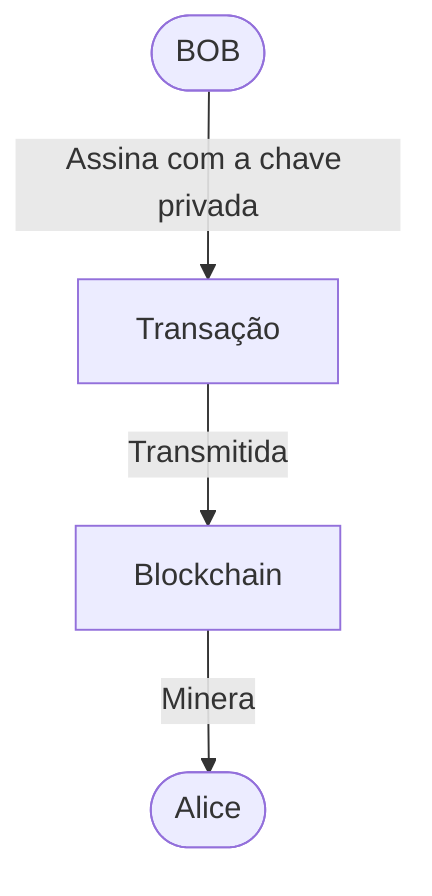

```mermaid
flowchart TD
    A(["Chave Privada"]) --> B["Chave Pública #1"] & n1@{ label: "<span style=\"padding-left:\">Chave Pública #2</span>" } & n2@{ label: "<span style=\"padding-left:\"><span style=\"padding-left:\">Chave Pública #3</span></span>" }
    B@{ shape: rect}
    n1@{ shape: rect}
    n2@{ shape: rect}
```

```mermaid
flowchart TD
    A(["BOB"]) -- Assina com a chave privada --> n1["Transação"]
    n1 -- Transmitida --> n2["Blockchain"]
    n2 -- Minera --> n3(["Alice"])
    n1@{ shape: rect}
```
